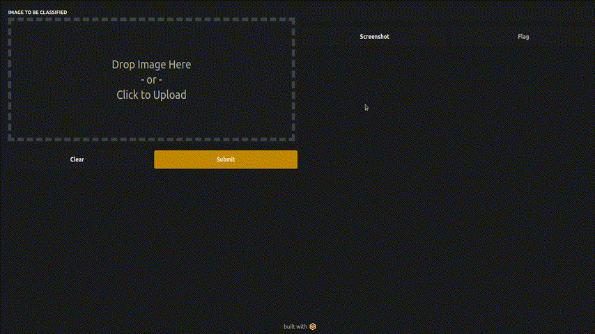

# Gradio: Image Captioning UI

A simple program to demostrate a image captioning visualization interface.



## Initialization

```bash
python3 -m pip install ../requirements.txt
```


## Usage

```bash
python3 image_captioning.py
```


## Urgent issues and future work
1. [nothing yet]


## Issues and future work
1. [nothing yet]
